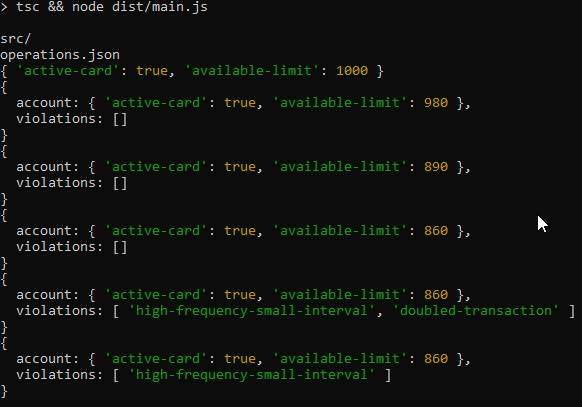

# Authorizer
## Overview

This app consist on an Authorizer that process transactions and applies business rules to approve them.

## Installation

In the project directory run the following line to install the project dependencies:

`npm install`

To run the project, run the following line

`npm start`

This will start a process that reads the input as file path on `stdin`



</td></tr></table>

This project is implemented on NodeJs and Jest for testing.
## Documentation
### Authorizer

The authorizer is an object that proccess transactions to an account if they go through the evaluator without any violations.

### Transaction Evaluator
The Transaction Evaluator class contains a list of IRule implemented classes that are used to validate the transactions
````
    constructor()
        {
            this._rules.push(new AccountInitializedRule);
            this._rules.push(new InsufficientLimitRule);
            this._rules.push(new CardNotActiveRule);
            this._rules.push(new HighFreqSIntervalRule);
            this._rules.push(new DoubledTransactionRule);
        }
````


## Adding new business rules
If a new business rule is required, an [IRule](./src/rules/IRule.ts) class should be implemented on the `./rules/transaction` 

This interface contains two methods.
- `execute(account: account, transaction: transaction)`: This method evaluates the transaction and account returning false if the rule is not matched
- `violationMessage()`: returns the message to be shown on the violation

